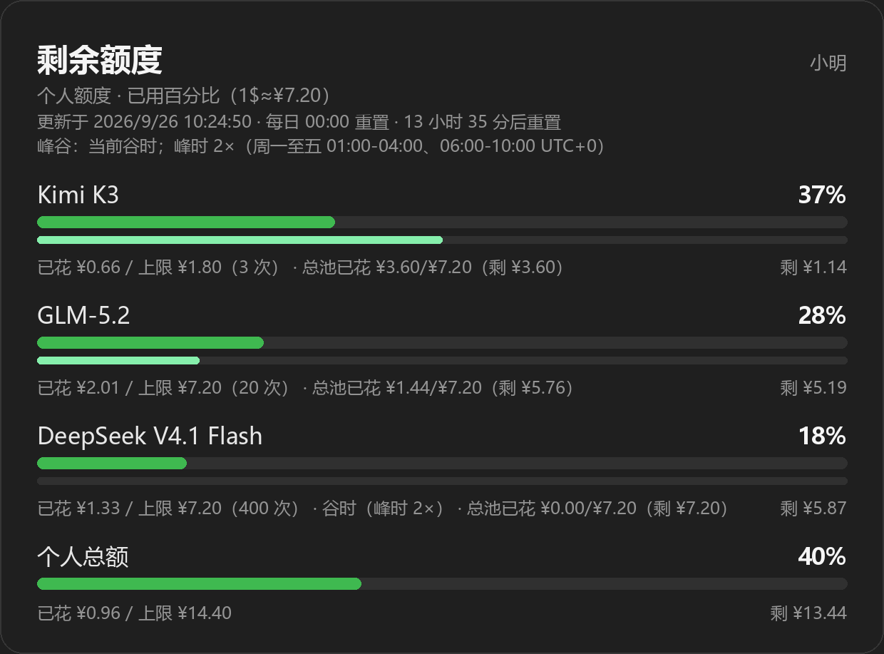

# 模型自选 · 每日限额（astrbot_plugin_model_quota，金额制）

让用户用指令自选对话的 AI 大模型，并按**金额**做每日限额：
配置用**美元**，展示给用户看的是**人民币**（汇率可配）。

## 安装

1. 把 `astrbot_plugin_model_quota` 文件夹放入 `AstrBot/data/plugins/`；
2. 重启 AstrBot（或在 WebUI 插件页重载）；
3. 在 WebUI「插件」中找到本插件，先配置各模型的**单次调用单价（美元）**，再设限额。

计费方式：按次计费。一次唤起 AI 的对话 = 1 次调用 = 扣一次单价。
单价可以手填，也可以直接用内置的 **OpenCode Go 价目预设**自动换算
（每月额度 ÷ 每月预估请求数），无需逐个填。单价为 0 的模型视为免费。

### 内置单价预设（`pricing_preset: opencode_go`，默认开启）

按 [OpenCode Go 官方价目](https://opencode.ai/docs/zh-cn/go/) 换算成「单次对话」成本，
覆盖 Kimi K3、GPT 5.6 Luna、GLM-5.x、Qwen3.x、DeepSeek V4 系列、Grok 4.x、
MiniMax、MiMo、Hy、LongCat、Muse Spark、Space Bunny Free 等全部在售模型。
按模型名自动匹配（大小写/空格/`opencode-go/` 前缀都能认），例如：

| 模型 | 每月额度 | 单次单价（低谷） |
|---|---|---|
| Kimi K3 | $15 | $0.0306 |
| GLM-5.2 / GLM-5.1 | $60 | $0.0140 |
| Qwen3.8 Max | $15 | $0.0185 |
| DeepSeek V4 Pro | $15 | $0.00288 |
| DeepSeek V4.1 Flash | $60 | $0.00046 |
| GPT 5.6 Luna | $15 | $0.0015 |
| MiMo-V2.6-Flash | $60 | $0.0004 |
| Space Bunny Free | 限时免费 | $0（免费） |

### 排除跑不通的模型（`unselectable_models`，黑名单）

有些模型可能因为**协议/地区/上游**原因用不了，把它们填进 `unselectable_models`
即可从 `/model` 列表、切换与插件页面里彻底移除（按提供商 ID 或模型名匹配，
忽略大小写与空格/短横线差异）：

```json
["gpt-6-luna", "gpt-5.6-luna", "grok-4.6", "grok-4.7",
 "muse-spark-1.2-contributor", "muse-spark-1.3-contributor"]
```

> 常见坑：OpenCode Go 一个 key 底下混了**三种协议**，AstrBot 一个 provider 只能有一种类型，
> 所以需要建多个 provider 指向同一个 `api_base`：
> `openai_chat_completion`（GLM/Kimi/DeepSeek/MiMo/Hy/LongCat/Space Bunny）、
> `openai_responses`（GPT 6 / GPT 5.6 Luna、Grok 4.6/4.7、Muse Spark）、
> `anthropic_chat_completion`（MiniMax、Qwen3.x）。
> 协议不匹配会报 400 `ModelProtocolUnsupported`。

### 只用 OpenCode 的模型（`opencode_only_models`，默认开启）

预设开启时，`/model` 列表、切换与插件页面**只包含 OpenCode 提供商的模型**：
按 provider 的 `api_base` 是否包含 `opencode_api_base_match`（默认 `opencode.ai`）判断，
也会认 provider/id 里带 `opencode` 的配置。
如果当前机器人一个 OpenCode 提供商都没有，会自动放开限制并在日志里提示，避免列表变空。
想混用其他提供商的模型，把 `opencode_only_models` 关掉即可。

### 峰谷定价（`peak_pricing_enabled`，默认开启）

官方仅 DeepSeek 系列有峰谷，**峰时价格为低谷的 2×**：

- 峰时：周一至周五 `01:00-04:00`、`06:00-10:00`（UTC，即北京时间 `09:00-12:00`、`14:00-18:00`）
- 低谷：其余时段 + 整个周末

插件在每次调用前按当时的时段取价并计费，卡片与列表会显示
`谷时（峰时 2×）` / `峰时 2×（当前）`。想按北京时间填区间，
把 `peak_timezone_offset` 设成 `8`、`peak_windows` 写成 `["09:00-12:00","14:00-18:00"]` 即可。
自建模型要参与峰谷，写进 `peak_models`；也可用 `model_peak_prices_usd` 直接指定峰时单价。

### 内置限额预设（`quota_preset: opencode_go`，默认开启）

按官方每月额度 ÷ 60 自动得出**每人每天每模型**的额度：

| 官方每月额度 | 每人每天额度 | 代表模型 |
|---|---|---|
| $60 | **$1.00** | GLM-5.2 / GLM-5.1 / 5.3-Flash、Kimi K2.6 / K2.7 Code、MiniMax M3 / M2.7、LongCat-2.0、Hy3、MiMo-V2.5、**DeepSeek V4.1 Flash**、Qwen3.7 / 3.6 Plus、Muse Spark |
| $30 | **$0.50** | Qwen3.8 Flash、Qwen3.7 Max、DeepSeek V4 Flash、Hy4 preview |
| $15 | **$0.25** | Kimi K3、Qwen3.8 Max、GLM-5.3、MiMo-V2.6-Pro / V2.5-Pro、DeepSeek V4 Pro / V4 Flash Vision Exp、GPT 5.6 / 6 Luna、Grok 4.6 / 4.7 |

另外两条全局规则（与预设同时生效）：

- **每 bot 每模型总池 $1**：只对官方月额度 **$15** 的模型生效（同一个 bot 上所有非管理员用户共享）。
  $30/$60 档的月额度远大于「全用户总额」，单设总池永远不会触发，因此不再单设，
  统一由下面的全用户总额约束；
- **每人每天消费总额 $1.5**（`default_user_total_quota_usd`）：跨模型、跨 bot 汇总；
- **全用户每日最大总额 $2**（`all_users_total_quota_usd`）：本 bot 上**所有用户、所有模型合计**的上限，
  按 bot 分开统计。总池是按模型分的，这一条是跨模型的整体预算。

> ⚠️ **总池按 bot 分开**：一个 bot 一个独立总池，多个 bot 之间不合并。
> 你有 7 个 bot，就是 7 个互不影响的池子，各自 $1/模型/天。
> 个人限额则跨 bot 合并（换 bot 不会重置你的 $1.5 总额度），避免来回切 bot 刷额度。

想手改就填 `model_user_quotas_usd` / `model_global_quotas_usd`（优先级高于预设），
或者把 `quota_preset` 设为 `off` 完全自己填。

## 用户指令

| 指令 | 说明 |
|---|---|
| `/model`（别名 `/模型`） | 开放自选的模型列表（带单价）、当前模型（`*`）、自己今日剩余额度 |
| `/model list` | 同上 |
| `/model use <序号\|ID>` | 切换当前对话的模型，例：`/model use 2`（序号按开放列表数） |
| `/model <序号\|名称\|ID>` | 快捷切换（`/model 2`、`/model Kimi K3`、`/model gpt-6-luna` 都可以；名称带空格也能直接写） |
| `/think` | 查看或修改当前模型的思考强度 |
| `/quota` | 查看自己今日剩余额度（原 `/model me` 已移除，用这个） |

`/model` 与 `/model list` 都会出**图片卡**（同 `/quota` 的渲染，Pillow 缺失时自动回退文本）。
两者现在都会为有总池的模型画出浅绿**总池条**与「总池已花 ¥X/¥Y（剩 ¥Z）」：
顶部是**最粗的「个人总额」**进度条，其下是中等粗细的**「全用户总额」**进度条，
再下面每行一个模型，带序号、单价、当日已用次数与剩余额度，当前模型标 `*`。

**群聊规则**：默认只有 **AstrBot 管理员**能切换模型；开启 `group_admins_can_switch` 后，
**本群群主/群管理员**（平台角色，不是 Bot 管理员）也能切换。普通群成员始终可以查看列表、查自己的剩余额度。
私聊谁都可以切换。

> 群管理员判定：OneBot v11（aiocqhttp）直接读群消息事件里的 `sender.role`
> （`owner` / `admin` / `member`），**零额外请求**；拿不到时回退调用平台的群成员列表接口。

切换按当前会话生效（私聊按人，群聊按整群）；消费按人统计，群里各人分开算。

## `/quota` 显示什么样（额度图片卡）

`/quota`（别名 `/额度`、`/限额`）默认发一张深色图片卡（下例即预设额度下的效果）：



卡片内容：标题「剩余额度」+ 用户名、副标题、更新/重置时间、
逐行「正常模型名 + 进度条 + 已用百分比」，有总池的模型在同一块内多一条
浅绿色总池进度条，总池花费与个人花费写在同一行，
「个人总额」（最粗）与「全用户总额」（中等）两行合计条，再是各模型（$15 档模型额外带一条浅绿总池条）；
用完的行标红并带 `※ 已用完`，卡片底部统一提示重置规则。

需要 Pillow + 中文字体（Windows 开箱即用；Linux 需 Noto/wqy）。
没有时自动回退下面的文本版（`quota_render` 可强制 `image`/`text`/`auto`）：

```text
📊 我今日剩余额度（1$≈¥7.20）：
- Kimi K3 ███ 37% 已花 ¥0.66/¥1.80（3 次）剩 ¥1.14 · 总池已花 ¥0.66/¥7.20（剩 ¥6.54）
- GLM-5.2 ██ 28% 已花 ¥2.01/¥7.20（20 次）剩 ¥5.19
- DeepSeek V4.1 Flash ██ 18% 已花 ¥1.33/¥7.20（400 次）剩 ¥5.87 · 谷时（峰时 2×）
💰 个人总额 ████ 37% 已花 ¥4.00/¥10.80 剩 ¥6.80
⏰ 每日 00:00 重置（13 小时后重置，明天 00:00）
🕐 当前谷时；峰时 2×（周一至五 01:00-04:00、06:00-10:00 UTC+0）
```

即：逐模型显示**正常模型名 + 已用次数 + 已花人民币 + 剩余/上限**，
有总池的模型总池花费并在同一行；
最后再有一行**个人今日总花费与剩余额度**。免费模型显示"免费·不限"。
文本版末尾会附重置时间与峰谷状态。

## 思考强度 `/think`

```text
/think              # 查看当前模型的思考强度
/think max          # 设为 max（可选 off / minimal / low / medium / high / max）
/think reset        # 清除设置，跟随模型服务自身配置
```

> ⚠️ **按模型生效，不是按人**。AstrBot 的 `reasoning_effort` 只能通过 provider 的
> `custom_extra_body` 生效（请求级的 kwargs 不会并入 payload），所以插件改的是
> 「这个模型在当前 bot 上的推理强度」，同模型的所有用户共用。

**谁能改思考强度**（由两个开关共同决定）：

| 身份 | `think_admin_only: true`（默认） | `think_admin_only: false` |
|---|---|---|
| Bot 管理员 | ✅ 可改 | ✅ 可改 |
| 群主 / 群管理员 | ✅ 可改（**需同时开启** `group_admins_can_switch`） | ✅ 可改 |
| 普通用户 | ❌ 只能 `/think` 查看 | ✅ 可改 |

> 也就是说：**默认情况下普通用户不能改思考强度**，只能查看；群管理员默认也不能，
> 必须显式开启 `group_admins_can_switch`。
>
> 若模型服务里已经手填了 `custom_extra_body.reasoning_effort`，两者会互相覆盖
> （本插件在每次调用前按当前设置写入）。

## 权限一览

| 操作 | 私聊 | 群聊 |
|---|---|---|
| 查看模型列表 / 剩余额度 | 所有人 | 所有人 |
| **切换模型** | 所有人 | Bot 管理员；开启 `group_admins_can_switch` 后本群群主/群管理员也可 |
| 查看思考强度 | 所有人 | 所有人 |
| **修改思考强度** | Bot 管理员；`think_admin_only: false` 时所有人 | Bot 管理员；开启 `group_admins_can_switch` 后本群群主/群管理员也可 |
| `/quota all`、`/quota usage`、`/quota reset` | 仅 Bot 管理员 | 仅 Bot 管理员 |

## WebUI 插件页面（模型 · 思考强度 · 额度）

在 WebUI 插件页打开本插件的 **「模型与额度」** 页面（`pages/panel/`），可以看到：

- **每个对话**一张卡片：对话名（平台 + 私聊/群号）、最后活跃时间、当前使用的模型、
  当前思考强度、峰谷状态、参与人数、合计已花；
- 卡片内**逐个模型**列出：已用次数、已花金额 / 个人上限、剩余额度、
  以及该 bot 的总池用量（浅色条）；
- 每个模型带两个重置按钮：**重置该模型额度**（只清这个对话）与
  **重置本 bot 全部对话**（清该 bot 上所有对话在该模型的用量）；
- 底部**模型目录表**：单价（低谷）、是否有峰谷、每人每日上限、每 bot 总池、思考强度。

页面通过 `window.AstrBotPluginPage` bridge 调用插件后端，接口为：

| 方法 | 路径 | 说明 |
|---|---|---|
| GET | `panel/overview` | 对话列表 + 模型目录 + 限额快照 |
| POST | `panel/reset` | `{provider_id, umo?, scope?}`，`scope` 为 `conversation`（默认）或 `bot` |
| POST | `panel/think` | `{provider_id, level}`，`level` 为级别或 `reset` |

> 对话索引在每次 AI 请求时记录（同一对话最快 60 秒写一次），按 bot 分开。
> 重置只清零用量记录，不改配置。

## 管理员指令（`/quota` 子命令，仅管理员）

| 指令 | 说明 |
|---|---|
| `/quota all` | 今日全量：**按 bot 分列**各模型单价、总池已花/上限、次数、每人上限 |
| `/quota usage` | 今日用量统计（按 bot 分组） |
| `/quota usage <用户ID>` | 查某用户今日明细（次数/花费/总花，支持 sender_id 子串匹配） |
| `/quota reset` | 清空今日全部记录（个人 + 所有 bot 的总池） |
| `/quota reset <用户ID>` | 只重置某用户（各 bot 总池随之更新） |

## 插件配置（WebUI 可视化编辑，单位美元）

| 配置项 | 默认 | 说明 |
|---|---|---|
| `selectable_models` | `[]` | **允许自选的模型白名单（提供商 ID 列表）**，例 `["vip", "default"]`；留空=全部可用；`/model` 列表与切换只认这里 |
| `model_display_names` | `{}` | **模型显示名映射**，例 `{"default": "Kimi K3", "vip": "GPT 5.6 Luna"}`；列表、卡片、额度、提示全部只显示真实模型名，ID 藏起来；切换用序号或名称（名称带空格可直接写，如 `/model use GPT 5.6 Luna`） |
| `pricing_preset` | opencode_go | 内置单价预设：`opencode_go` 自动按官方价目换算；`off` 只用下面手填的 |
| `default_call_price_usd` | 0 | 单次调用默认单价；0=免费不限 |
| `model_call_prices_usd` | `{}` | 按模型覆盖单价（低谷价），优先级高于预设；例 `{"vip": 0.05}` |
| `peak_pricing_enabled` | true | 启用峰谷定价 |
| `peak_multiplier` | 2.0 | 峰时价格倍数（官方 DeepSeek 为 2） |
| `peak_windows` | `["01:00-04:00","06:00-10:00"]` | 峰时区间，可多个、支持跨天 |
| `peak_timezone_offset` | 0 | 峰时区偏移（官方按 UTC，故默认 0；填 8 可用北京时间） |
| `peak_weekdays_only` | true | 周末全天低谷 |
| `peak_models` | `[]` | 额外参与峰谷的模型（预设里的 DeepSeek 已自动包含） |
| `model_peak_prices_usd` | `{}` | 直接指定峰时单价，优先于「低谷价×倍数」 |
| `quota_preset` | opencode_go | 内置限额预设：按官方月额度 ÷ 60 得出每人每日额度（$60→$1、$30→$0.5、$15→$0.25）；`off` 只用手填 |
| `default_user_model_quota_usd` | 1.0 | 未命中预设且未单独配置时的每人每天每模型默认限额 |
| `model_user_quotas_usd` | `{}` | 按模型覆盖个人限额，例 `{"vip": 5.0}` |
| `default_user_total_quota_usd` | 1.5 | **每人每天全部模型消费总额度**（跨 bot 汇总） |
| `all_users_total_quota_usd` | 2.0 | **全用户每日最大总额**（本 bot 所有用户 + 所有模型合计，各 bot 独立） |
| `default_global_quota_usd` | 1.0 | 总池兜底值（预设下仅 $15 档模型有 $1 总池，其余不限）；各 bot 独立；0=不限 |
| `model_global_quotas_usd` | `{}` | 按模型覆盖总池（单 bot），例 `{"vip": 100.0}` |
| `usd_to_cny_rate` | 7.2 | 汇率，只影响展示 |
| `quota_render` | auto | 个人额度展示：`auto`/`image`（图片卡）/`text` |
| `admin_exempt` | true | 管理员免限额且不计数（不占总池）。**注意**：开启时管理员自己的用量永远是 0 次/¥0.00，卡片和 `/quota` 会显示「管理员免限额，用量不计数」提示；想看到计数请用普通账号，或把此项关掉（管理员也会被限额） |
| `opencode_only_models` | true | 预设下只展示 OpenCode 提供商的模型 |
| `opencode_api_base_match` | `opencode.ai` | 判定 OpenCode 提供商的 api_base 关键字 |
| `unselectable_models` | `[]` | **黑名单**：排除跑不通的模型（填 ID 或模型名即可） |
| `think_enabled` | true | 启用 `/think` 思考强度命令 |
| `think_admin_only` | true | 思考强度仅管理员可改（普通用户仍可查看） |
| `group_admins_can_switch` | false | **允许群主/群管理员（非 Bot 管理员）切换模型与改思考强度**；仅群聊生效，私聊不受影响 |
| `think_levels` | `["off","minimal","low","medium","high","max"]` | 允许的级别（`off` 写成 API 的 `none`） |
| `default_think_effort` | 空 | 留空=不改写 provider，跟随模型服务自身配置 |

拦截顺序：**个人单模型 → 个人总额 → 全用户总额 → 单模型总池**。

`model_*` 的 key 是 WebUI「模型服务」中的**提供商 ID**；
缺省走 default；`<=0` 视为不限。

## 行为说明 / FAQ

- 指令消息（`/model` 等）不会触发 AI，不扣费。
- 钱够 precision：允许"刚好够一次"的扣费（`已花+单价 > 上限` 才拦）。
- 切换到已不够钱的模型：允许切换，但警告"暂时无法用它对话"。
- 跨天按服务器本地日期自动清零；用量存插件 KV（`daily_usage_v2`）。
- provider 改名/删除后旧记录残留但不再命中；配置里写错的 ID 会在日志 warning。
